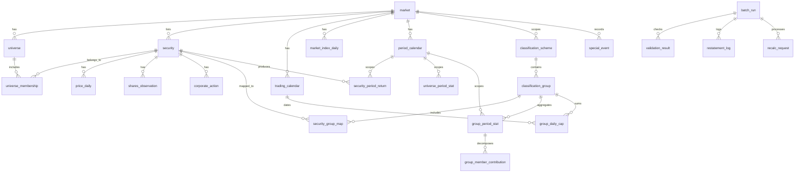

# 02. 도메인 모델 및 데이터 모델

> **테이블 정의(DDL)의 단일 출처는 [`theme_radar/db/migrations/`](../theme_radar/db/migrations/)의 SQL 파일이다.** 컬럼 타입, 제약, 코드값, 컬럼별 설명은 SQL 파일과 그 주석을 본다. 이 문서는 테이블의 목적, 키, 조회·적재 규약을 설명한다. 스키마를 바꿀 때는 새 마이그레이션 파일을 추가하고 이 문서의 규약을 함께 고친다.

## 1. 레이어 구분

| 레이어 | 성격 | 테이블 |
| --- | --- | --- |
| **마스터** | 외부/자체 공급, 저빈도 변경, 이력 관리 | `market`, `universe`, `security`, `universe_membership`, `classification_scheme`, `classification_group`, `security_group_map` |
| **원천 시계열** | 일 단위 적재 | `trading_calendar`, `price_daily`, `shares_observation`, `corporate_action`, `special_event` |
| **파생(집계)** | 배치로 산출, 재계산 가능 | `period_calendar`, `security_period_return`, `universe_period_stat`, `group_period_stat`, `group_member_contribution`, `group_daily_cap` |
| **운영** | 실행 기록, 검증 결과, 재계산 요청 | `batch_run`, `validation_result`, `restatement_log`, `recalc_request` |

파생 레이어는 **언제든 원천으로부터 전량 재생성 가능**해야 한다. 파생 테이블에 수기 보정값을 넣지 않는다.

### 1.1 저장 규약

| 항목 | 규약 |
| --- | --- |
| DB | SQLite 파일 하나 `data/theme_radar.sqlite3` ([09 §4.1](09-tech-stack.md#41-db-sqlite)). 모든 테이블은 `STRICT`다 |
| 날짜 | `TEXT` `YYYY-MM-DD`, 거래소 현지 날짜. as-of 조회를 문자열 비교로 하므로 형식을 `CHECK`로 강제한다 |
| 시각 | `TEXT` ISO-8601 UTC (`2026-09-15T09:31:22Z`) |
| 수치 | 수익률·비중·가격·시총은 `REAL`(배정밀도). [03 §11](03-metrics-spec.md#11-정밀도-및-반올림)이 허용하는 방식이다 |
| 참거짓 | `INTEGER` 0/1 |
| 코드값 | `TEXT` + `CHECK (... IN (...))`. 코드값을 추가하려면 마이그레이션이 필요하다. 출처 코드(`price_source` 등)는 어댑터 교체로 늘어나므로 `CHECK`를 두지 않는다 |
| 외래키 | 마스터·원천·운영 테이블에 건다. 파생 테이블은 전량 재생성하므로 걸지 않는다 |
| 트랜잭션 | 연결은 자동 커밋 모드로 열고, 여러 문장을 쓰는 작업은 `BEGIN IMMEDIATE` 트랜잭션으로 묶는다 (`theme_radar/db/connection.py`) |

**유효기간과 as-of 조회.** 이력 테이블은 `valid_from`, `valid_to`를 가지며 구간은 양끝 포함(closed interval)이다. 종료가 없으면 `valid_to = '9999-12-31'`이다. 시점 `:as_of`의 행은 `valid_from <= :as_of AND :as_of <= valid_to`로 찾는다. 전 테이블에서 이 규약을 통일한다.

## 2. ERD



## 3. 마스터 테이블

### 3.1 market · universe

- `market`은 시장(KR, US)의 통화와 시간대, `universe`는 유니버스(`KR_COMMON`, `US_SP500`)의 이름과 시장이다.
- 두 테이블과 `classification_scheme`의 기준 코드는 마이그레이션이 넣는다. 코드 값의 단일 출처는 DB이며 애플리케이션 코드에 하드코딩하지 않는다([§7](#7-코드-체계-참고)).

### 3.2 security

키: `security_id` (내부 불변 정수)

- `security_id`는 티커 변경·사명 변경과 무관하게 유지한다.
- **상장 중인 종목끼리는 `(market_code, ticker)`가 유일하다** (부분 유니크 인덱스). 폐지된 종목의 티커는 다른 종목이 다시 쓸 수 있으므로 티커 단독 유일키를 두지 않는다.
- 종목코드는 항상 문자열이다. KR은 선행 0과 영문자(`0197V0`)가 있고, US는 점 표기(`BRK.B`)로 저장한다. 출처별 표기(Yahoo `BRK-B`)는 어댑터에서 바꾼다.
- `cik`는 US 종목의 SEC CIK 10자리다. SEC 주식수 조회와 복수 클래스 묶음에 쓴다([07 §8.3](07-price-ingestion.md#83-주식수)).
- 과거 티커 이력은 두지 않는다([§9](#9-결정-기록) S-12). 티커가 바뀐 종목은 새 종목으로 만들지 않고 기존 `security_id`의 `ticker`를 갱신해 가격 이력을 잇는다.

### 3.3 universe_membership

키: `(universe_code, security_id, valid_from)`

유니버스 편입 이력. KR은 마스터 조건에서 생성하고, US는 지수 구성종목 변경 이력으로 적재한다.

- 같은 유니버스에서 한 종목의 편입 기간은 겹치지 않는다. 겹치는 행은 트리거가 거부한다.

`KR_COMMON` 생성 조건 (기준일 as-of):

```
security.market_code = 'KR'
AND security.board IN ('KOSPI','KOSDAQ')
AND security.security_type = 'COMMON'
AND security.listing_date <= :as_of
AND (security.delisting_date IS NULL OR security.delisting_date > :as_of)
```

제외 대상의 구체적인 판정 순서는 [07 §7.1](07-price-ingestion.md#71-종목-마스터와-유니버스)을 따른다.

### 3.4 classification_scheme / classification_group

`classification_scheme` 키: `scheme_code` · `classification_group` 키: `(scheme_code, group_code)`

- 섹터 스킴(`scheme_type = 'SECTOR'`)은 배타적(`is_exclusive = 1`), 테마 스킴은 비배타적이다. `CHECK`로 강제한다.
- **집계 단위가 되는 계층만 등록한다.** 계층마다 스킴을 따로 둔다: `WI26` 대분류 26개, `WI26_SUB` 소분류 48개, `GICS` 섹터 11개, `GICS_IND` 산업 74개. 한 스킴 안에 두 계층을 섞지 않는다([§9](#9-결정-기록) S-2).
- `group_code`는 분류 체계의 공식 코드를 쓰며 다른 뜻으로 재사용하지 않는다. 그룹의 신설·폐지는 `valid_from`, `valid_to`로 표시하고, 명칭 변경은 행을 갱신한다.
- `group_name`은 화면 표시명이다. WI26은 한국어 섹터명, **GICS는 영문 섹터명**(`Information Technology`)을 쓴다. GICS 한국어 이름은 두지 않는다(S-13).
- `color_hex`는 **섹터별 고정 색상**을 보장하기 위한 값이다. 조회 조건이나 순위가 바뀌어도 같은 섹터는 항상 같은 색으로 그린다. 값은 [`data/group_colors.csv`](../data/group_colors.csv)에서 분류 그룹을 적재할 때 함께 넣는다.
- 계층이 다른 두 스킴은 **같은 파일의 다른 컬럼**을 읽는다. 어느 파일의 어느 컬럼인지는 [`master/groups.py`](../theme_radar/master/groups.py)의 `SCHEMES`가 단일 출처다.
- 색은 **산업 계열**을 나타낸다. 범주형 색은 색각 이상 검증을 통과한 8색을 넘길 수 없으므로(9번째 색을 만들지 않는다), 26개·11개 섹터에 서로 다른 색을 주지 않고 8개 계열에 나눠 준다. 두 시장의 같은 계열은 같은 색이다(IT 파랑, 산업재 주황, 건강관리·필수소비재 청록, 소재 노랑, 경기소비재 분홍, 금융·부동산 초록, 커뮤니케이션 보라, 에너지·유틸리티 빨강). 개별 섹터는 끝단 라벨과 호버 강조로 구분한다([06 §8](06-ui-spec.md#8-접근성-및-반응형)). 저장 값은 라이트 테마 색이며, 다크 테마에서는 화면이 같은 계열의 다크 단계로 바꾼다(S-15).
- `UNMAPPED`는 등록하지 않는다. 미매핑 종목을 집계하는 의사 그룹이며 파생 테이블에만 나타난다.

### 3.5 security_group_map

키: `(scheme_code, security_id, group_code, valid_from)`

자체 제공 분류 매핑의 실체. 시스템의 핵심 입력이다.

**현재는 최신 분류 스냅샷 하나만 쓴다** (S-14). WI26은 [`wi26_constituents.csv`](../data/wi26_constituents.csv), GICS는 [`gics_sp500_constituents.csv`](../data/gics_sp500_constituents.csv)의 매핑을 `valid_from = 수집 시작일(2025-01-01)`, `valid_to = 9999-12-31`로 적재해 전 기간에 적용한다.

- 스냅샷 이전에 폐지·편출된 종목은 매핑이 없으므로 `UNMAPPED`로 집계된다. 규모는 `unmapped_cap_ratio`(V-8)로 확인한다.
- 분류 변경 이력(유효기간 절단, `RECLASS` 특이사항)은 이후 매핑이 실제로 바뀔 때 다룬다.

**무결성 제약** (트리거가 INSERT·UPDATE를 거부한다)

- 배타 스킴: 한 종목의 매핑은 그룹과 무관하게 유효기간이 겹칠 수 없다. 동시에 두 섹터에 속할 수 없다.
- 비배타 스킴(테마): 한 종목이 여러 그룹에 동시에 속할 수 있다. 같은 그룹 매핑끼리는 기간이 겹칠 수 없다.
- 키가 같은 행의 UPSERT(`ON CONFLICT DO UPDATE`)는 허용한다. 같은 파일을 다시 적재해도 실패하지 않는다.
- 매핑이 없는 종목은 계산에서 `UNMAPPED` 그룹으로 분리 집계하고, 커버리지 경보 대상으로 삼는다 ([04 §5](04-pipeline.md#5-데이터-품질-검증)).

## 4. 원천 시계열 테이블

### 4.1 trading_calendar

키: `(market_code, trade_date)`

- **거래일만 저장한다.** 시장 지수 시계열에서 만든다(KR `KOSPI`, US `^GSPC`). 휴장일 행은 없다.
- 미래 거래일은 알 수 없으므로 진행 중 기간은 최신 거래일 기준으로 계산한다([01 §5](01-requirements.md#5-기간-체계-period)).

### 4.2 price_daily

키: `(security_id, trade_date)`

- `market_cap`은 **무수정 종가 × 상장주식수**로 산출한다. 수정주가로 계산하면 시가총액이 왜곡된다.
- `close_adj`는 수익률 계산 전용이다. 수정계수는 소급 변경될 수 있으므로 변경 감지 시 재계산을 요청한다(`recalc_request`).
- `close_raw`, `shares_listed`는 적재 후 바꾸지 않는다. 기업행위는 `adj_factor`, `close_adj`의 소급 갱신으로만 반영한다([07 §9](07-price-ingestion.md#9-액면분할병합-소급-갱신)).
- `close_raw`는 원칙적으로 값이 있다. 이미 폐지된 종목에서 원종가를 확정할 수 없는 날만 `NULL`이며, 이때 `adj_factor`와 `market_cap`도 `NULL`이다([07 §7.2](07-price-ingestion.md#72-무수정-종가)).
- `trade_status = 'SUSPENDED'` 구간은 직전 정상 종가를 캐리포워드하되 상태 값은 유지한다.
- `price_source`, `adj_source`, `fetched_at`, `adj_updated_at`은 출처 추적 컬럼이다.

### 4.3 수집 보조 테이블

| 테이블 | 키 | 용도 |
| --- | --- | --- |
| `shares_observation` | `(security_id, as_of_date, source)` | 출처별 상장주식수 관측치. `price_daily.shares_listed`는 여기서 as-of 규칙과 출처 우선순위로 채운다 ([07 §6](07-price-ingestion.md#6-저장소-스키마)) |
| `corporate_action` | `(security_id, ex_date, source)` | 분할·병합 등 기업행위 기록. 가격 계수와 주식수 비율을 따로 둔다 ([07 §9](07-price-ingestion.md#9-액면분할병합-소급-갱신)) |
| `special_event` | `event_id` | 특이사항. 가격이 아닌 이유로 섹터 시총을 바꾸거나 계산에 오차를 남기는 사건 ([07 §11.2](07-price-ingestion.md#112-특이사항)) |

- `special_event.source`는 그 사건을 만든 값의 수집 출처다. 원천 테이블의 출처 코드를 그대로 쓴다 ([07 §11.2](07-price-ingestion.md#112-특이사항)).
- `special_event`는 `(market_code, event_type, security_id, event_date)`로 한 번만 기록한다. 시장 단위 사건은 `security_id`가 `NULL`이므로, 유니크 인덱스에서 `IFNULL(security_id, 0)`을 쓴다.

### 4.4 market_index_daily

키: `(market_code, index_code, trade_date)`

- 시장 지수 일봉이다. 거래일 캘린더를 만들며 받아 오던 지수 시계열(KR 네이버 `KOSPI`, US yfinance `^GSPC`)의 시가·고가·저가·종가를 남긴 것이다([07 §12](07-price-ingestion.md#12-시장-지수-일봉)). 시장마다 지수 하나를 쓴다: KR `KOSPI`, US `SPX`.
- 값은 **지수 포인트**다. 통화 단위가 없고, 분할·배당 조정도 없어 받은 값을 그대로 둔다.
- 우리가 계산하는 유니버스 수익률과는 다른 값이다. 구성 종목도 산출식도 거래소의 것이며, 섹터 흐름을 볼 때 **시장 전체의 배경**으로만 쓴다([06 §3.6](06-ui-spec.md#36-시장-지수와-섹터-캔들)).
- 기간 단위 캔들 값은 저장하지 않고 API가 조회할 때 만든다([05 §4.2](05-api-spec.md#42-get-marketindex)).

## 5. 파생(집계) 테이블

계산 정의는 [03](03-metrics-spec.md), 계산 순서와 재계산 정책은 [04](04-pipeline.md)를 따른다. `calc_version`, `calculated_at`은 어떤 로직으로 언제 산출한 값인지 추적한다.

### 5.1 period_calendar

키: `(market_code, period_type, period_id)` · 유일: `(market_code, period_type, period_seq)`

- `period_id` 형식은 주 `YYYY-Www`, 월 `YYYY-MM`이며 `period_type`에 맞는지 `CHECK`로 강제한다.
- `period_seq`는 ISO week-year의 연도 경계 문제를 피하기 위한 정렬 전용 정수 키다. 시장·단위별로 **존재하는 기간마다 1씩 증가**하므로 `period_seq - 1`이 직전 기간이다. 문자열 `period_id` 정렬에 의존하지 않는다.
- ISO 주차는 Python `date.isocalendar()`로 계산한다. 내장 SQLite(3.45.3)에는 ISO 주차 형식 문자가 없다.
- 시장별 거래일 캘린더가 다르므로 동일 `period_id`라도 `end_date`는 시장마다 다르다.
- 거래일이 0일인 기간은 행을 생성하지 않는다.

### 5.2 security_period_return

키: `(universe_code, period_type, period_id, security_id)`

기간별 종목 수익률, 기준일 시가총액, 유니버스 내 비중, 포함 판정(`incl_status`, [03 §10](03-metrics-spec.md#10-예외-처리)). 제외 종목도 사유와 함께 행을 남긴다.

### 5.3 universe_period_stat

키: `(universe_code, period_type, period_id)` · 유일: `(universe_code, period_type, period_seq)`

유니버스 수익률(시총가중·동일가중·중앙값), 구성 종목 수, 미매핑 시총 비중. `period_seq`로 구간을 조회한다.

### 5.4 group_period_stat

키: `(universe_code, scheme_code, period_type, period_id, group_code)`

범프 차트와 기여도 화면의 주 조회 대상. **단일 테이블 조회로 화면이 그려지도록** 수익률·비중·기여도·순위·집중도를 비정규화해 담는다.

- 인덱스: 구간 조회용 `(universe_code, scheme_code, period_type, period_seq)`, 섹터 시계열용 `(…, group_code, period_seq)`. 단일 기간 스냅샷은 키 선두로 찾는다.
- 비배타 스킴에서는 `base_weight`, `contribution`, `contrib_share`가 `NULL`이다.
- `rank_ret`은 분류 체계의 그룹에만 있다. 미매핑(`UNMAPPED`) 행은 순위가 `NULL`이다 ([§9](#9-결정-기록) S-16).
- 하락 기여 기준 집중도(`top1/3/5_neg_contrib_share`)를 함께 저장한다([03 §9.1](03-metrics-spec.md#91-상위-기여-집중도)).

### 5.5 group_member_contribution

키: `(universe_code, scheme_code, period_type, period_id, group_code, security_id)`

드릴다운 전용. **포함된 전 종목**의 그룹 내 비중, 수익률, 기여도, 그룹 내 기여 순위를 저장한다([§9](#9-결정-기록) S-1).

- 행 수는 배타 스킴 기준 `security_period_return`의 포함 종목 수와 같다(연 약 18.6만 행, [04 §6.1](04-pipeline.md#61-데이터-규모-추정)).
- 드릴다운의 "기타 N종목" 합산은 API가 조회 시 반환하지 않은 종목을 더해 만든다([05 §5.1](05-api-spec.md#51-get-sectorsgroup_codebreakdown)).

### 5.6 group_daily_cap

키: `(universe_code, scheme_code, group_code, trade_date)`

드릴다운의 섹터 시가총액 차트 전용([06 §5.4](06-ui-spec.md#54-섹터-시가총액-차트)). 거래일마다 그날의 유니버스 구성원과 분류 매핑으로 더한 그룹 시가총액과 더한 종목 수다. 정의는 [03 §14](03-metrics-spec.md#14-섹터-시가총액)에 있다.

- 일별 값만 저장한다. 기간 단위 시가·고가·저가·종가는 API가 조회할 때 만들고([05 §5.3](05-api-spec.md#53-get-sectorsgroup_codemarket-cap)), 이동평균은 화면이 계산한다([§9](#9-결정-기록) S-17). 시장 지수(`market_index_daily`)도 같은 규약이다.
- 미매핑 종목은 `UNMAPPED` 행으로 더한다. 배타 스킴에서 한 날짜의 그룹 합은 그날 유니버스 시총과 같다.
- 행 수는 (그룹 수 + 1) × 거래일 수다. 2025-01 이후 KR 11,205행 · US 5,080행이다.

## 6. 입력 데이터 규격

### 6.1 분류 매핑 파일 (security_group_map 적재)

UTF-8 CSV, 헤더 필수.

```csv
scheme_code,market_code,ticker,group_code,valid_from,valid_to
WI26,KR,005930,WI620,2020-01-01,9999-12-31
WI26,KR,000660,WI620,2020-01-01,9999-12-31
GICS,US,AAPL,45,2020-01-01,9999-12-31
```

| 컬럼 | 규칙 |
| --- | --- |
| `scheme_code` | `classification_scheme`에 사전 등록되어 있어야 함 |
| `market_code` + `ticker` | 적재 시 `security_id`로 해석. 미해석 행이 있으면 배치 실패 |
| `group_code` | `classification_group`에 사전 등록되어 있어야 함. 분류 체계의 공식 코드를 쓴다 ([§7](#7-코드-체계-참고)) |
| `valid_from` / `valid_to` | `YYYY-MM-DD`, 양끝 포함. `valid_to` 생략 시 `9999-12-31` |

**적재 규칙**

- 배치는 **원자적(all-or-nothing)** 이다. 검증 실패 행이 하나라도 있으면 커밋하지 않는다.
- 배타 스킴에서 기존 유효 매핑과 기간이 겹치면, 신규 `valid_from`의 전일로 기존 행의 `valid_to`를 절단(close-out)한 뒤 신규 행을 삽입한다. 순서를 지키지 않으면 트리거가 거부한다.
- 소급 기간의 매핑이 변경되면 해당 시점 이후 전 기간의 파생 테이블 재계산을 요청한다 ([04 §4](04-pipeline.md#4-재계산-정책)).

### 6.2 S&P 500 구성종목 파일 (universe_membership 적재)

```csv
universe_code,ticker,valid_from,valid_to
US_SP500,AAPL,2015-01-01,9999-12-31
US_SP500,XYZ,2021-03-22,2024-06-14
```

### 6.3 일별 시세 (price_daily 적재)

```csv
market_code,ticker,trade_date,close_raw,adj_factor,shares_listed,volume,trade_status
KR,005930,2026-01-09,71200,1.0,5969782550,12345678,NORMAL
```

`close_adj`와 `market_cap`은 적재 시 계산해 저장한다.

## 7. 코드 체계 참고

- **WI26**: 대분류 26종 / 소분류 48종. 실제 코드·명칭은 수집 데이터 [`data/wi26_classification.csv`](../data/wi26_classification.csv)를 단일 출처로 하며, **대분류 26종**을 `classification_group`에 선등록한다.

  | | | | | | |
  | --- | --- | --- | --- | --- | --- |
  | WI100 에너지 | WI110 화학 | WI200 비철금속 | WI210 철강 | WI220 건설 | WI230 기계 |
  | WI240 조선 | WI250 상사,자본재 | WI260 운송 | WI300 자동차 | WI310 화장품,의류 | WI320 호텔,레저 |
  | WI330 미디어,교육 | WI340 소매(유통) | WI400 필수소비재 | WI410 건강관리 | WI500 은행 | WI510 증권 |
  | WI520 보험 | WI600 소프트웨어 | WI610 IT하드웨어 | WI620 반도체 | WI630 IT가전 | WI640 디스플레이 |
  | WI700 통신서비스 | WI800 유틸리티 | | | | |

  `group_code`는 `WI100` 형식의 원 코드를 그대로 쓴다. 섹터명에 쉼표가 포함되므로(`상사,자본재`) CSV 취급 시 따옴표 처리가 필요하다. 소분류(`WI10010` 등)는 등록하지 않는다. 종목별 소분류 데이터도 없다.
- **GICS**: 섹터 11종 / 산업그룹 25종 / 산업 74종 / 소분류 163종. 실제 코드·명칭은 [`data/gics_classification.csv`](../data/gics_classification.csv)(MSCI GICS Methodology 2024-08판에서 생성)를 단일 출처로 하며, **섹터 11종**을 `classification_group`에 선등록한다.

  | | | | |
  | --- | --- | --- | --- |
  | 10 Energy | 15 Materials | 20 Industrials | 25 Consumer Discretionary |
  | 30 Consumer Staples | 35 Health Care | 40 Financials | 45 Information Technology |
  | 50 Communication Services | 55 Utilities | 60 Real Estate | |

  `group_code`는 GICS **공식 숫자 코드**를 그대로 쓴다(`45`). `INFO_TECH` 같은 별칭 코드는 만들지 않는다. 하위 코드(`4530` / `453010` / `45301020`)는 상위 코드를 접두어로 포함하므로, 하위 단계를 쓰게 되더라도 `TEXT`로 저장·비교하고 정수로 변환하지 않는다.
- 두 체계 모두 **코드 값의 단일 출처는 DB 마스터**이며, 애플리케이션 코드에 하드코딩하지 않는다. 별칭 코드(`SEMICON`, `INFO_TECH` 등)는 두지 않고 공식 코드만 쓴다.

## 8. 운영 테이블

| 테이블 | 키 | 용도 |
| --- | --- | --- |
| `batch_run` | `run_id` | 작업 실행 기록. 상태(`RUNNING`, `SUCCEEDED`, `FAILED`, `BLOCKED`), 대상 범위, `calc_version` ([04 §7](04-pipeline.md#7-운영-메타데이터)) |
| `validation_result` | `(run_id, rule_code, scope)` | 수집 검증(C-1 ~ C-13)과 계산 검증(V-1 ~ V-9) 결과. `severity`(`BLOCK`/`WARN`)로 차단과 경고를 구분한다. 통과하지 못한 경고 행이 점검 대상 목록을 겸한다 |
| `restatement_log` | `(run_id, security_id)` | 수정계수 소급 갱신 기록 ([07 §9.3](07-price-ingestion.md#93-갱신-절차)) |
| `recalc_request` | `request_id` | 소급 변경으로 생긴 재계산 요청. `processed_at`이 `NULL`이면 대기 중이며, 대기 중인 구간의 API 응답은 `stale = true`다 ([04 §4](04-pipeline.md#4-재계산-정책)) |

## 9. 결정 기록

2026-09-15 확정. 초안 DDL(PostgreSQL 형식)을 SQLite로 옮기면서 정한 사항이다.

| # | 항목 | 결정 | 이유 |
| --- | --- | --- | --- |
| S-1 | 종목 기여도 저장 범위 | 포함된 전 종목을 저장한다. "기타" 합산 행은 저장하지 않고 API가 만든다 | 05의 조회 상한 100과 종목 검색 드릴다운을 지원한다. 연 18.6만 행으로, 상·하위 20 저장(연 10만 행)과 차이가 작다 |
| S-2 | 분류 계층 | **계층마다 스킴을 따로 둔다.** 섹터 레벨(`WI26`·`GICS`)과 세분류 레벨(`WI26_SUB`·`GICS_IND`)을 나란히 등록하고, 화면의 분류 선택으로 오간다 | 26개·11개는 섹터 흐름을 보기엔 굵다. 스키마·API·화면이 이미 스킴에 대해 일반적이라 행만 늘리면 되고, 굵은 뷰를 잃지 않는다. 대신 집계량이 배로 는다(US full 기준 20초 → 39초). **초안에서는 섹터만 등록했다** — 근거였던 "WI26은 종목별 소분류가 없다"는 WICS 소분류를 경유해 풀었다(S-19) |
| S-3 | DDL 위치 | 마이그레이션 SQL이 단일 출처. 02는 목적·키·규약만 적는다 | 한 곳만 고친다 |
| S-4 | `classification_group` 키 | `(scheme_code, group_code)`. 유효기간은 일반 컬럼 | 매핑 테이블에서 외래키를 걸 수 있다. 그룹 코드는 재사용하지 않는다 |
| S-5 | `security_group_map` 키 | `group_code`를 키에 넣는다 | 초안 키로는 테마 스킴에서 한 종목을 같은 날 두 그룹에 넣을 수 없었다 |
| S-6 | 유효기간 중첩 | 트리거로 DB가 거부한다 | 적재 코드의 검증과 별개로 DB 수준에서 보장한다 |
| S-7 | 티커 유일성 | 상장 중인 종목끼리만 유일 (부분 인덱스) | US는 상장일을 모르는 종목이 있어 초안의 `(market, ticker, listing_date)` 유일키가 `NULL`로 무력해진다 |
| S-8 | `universe` 테이블 | 신설하고 기준 코드를 마이그레이션이 넣는다 | 05 `/meta/universes`의 출처. 코드를 앱에 하드코딩하지 않는다 |
| S-9 | `trading_calendar.is_open` | 없앤다. 거래일만 저장한다 | 지수 시계열로 만들어 휴장일 행이 생기지 않는다 |
| S-10 | `price_daily.close_raw` | 원종가를 확정할 수 없는 폐지 종목의 날만 `NULL` 허용 | 07 §7.2 규칙. 수정 종가는 남겨 수익률 계산에 쓴다 |
| S-11 | 추가 컬럼 | `security.cik`, `universe_period_stat.period_seq`, `group_period_stat.top1/3/5_neg_contrib_share`, `validation_result.severity` | SEC 조회(07 §8.3), 구간 조회, 03 §9.1 하락 기여 집중도, `status` 명령의 차단·경고 구분 |
| S-12 | 티커 변경 이력 (`security_alias`) | 두지 않는다. 티커가 바뀌면 기존 종목의 `ticker`를 갱신한다 | 긴 기간을 조회하지 않으므로 과거 티커를 쓸 일이 없다 |
| S-13 | GICS 섹터 표시명 | 영문명을 쓰고 한국어 이름은 두지 않는다. 섹터 색상은 개발 측에서 정한다 | 사용자 결정 (2026-09-15) |
| S-14 | 분류 매핑 이력 | 현재 스냅샷 하나를 전 기간에 적용한다. 과거 이력은 만들지 않는다. 다시 적재하면 스킴의 매핑을 통째로 바꾸고 재계산을 요청한다 | 매핑이 실제로 바뀔 때 이력 처리를 정한다 |
| S-16 | 미매핑 순위 | `UNMAPPED`는 순위를 받지 않는다(`rank_ret` NULL 허용, 마이그레이션 0002) | 분류 체계의 섹터가 아니다. 기여도 가산성을 위해 행은 남긴다 |
| S-17 | 섹터 시가총액 저장 (2026-09-16) | 일별 그룹 시총만 `group_daily_cap`에 저장한다. 기간 캔들 값은 API가 만들고, 이동평균은 저장하지 않고 화면이 계산한다 | 요청 때마다 종목 시세를 더하면 104주 구간에서 KR 2,500종목 × 520거래일을 읽는다. 기간 값은 일별 값의 처음·끝·최소·최대라 조회 때 만들어도 싸다. 이동평균은 사용자가 기간을 고르므로 저장할 값이 정해지지 않는다(사용자 결정) |
| S-18 | 시장 지수 저장 (2026-09-19) | 거래일 캘린더를 만들며 이미 받던 지수 일봉을 `market_index_daily`(마이그레이션 0005)에 남긴다. 기간 캔들 값은 API가 만든다 | 화면 오른쪽에 시장 배경을 두려면 지수가 필요한데(06 §3.6), 새 출처를 붙일 필요가 없다. 날짜만 쓰고 버리던 값을 남기는 것이라 수집 비용이 늘지 않는다 |
| S-19 | KR 소분류 출처 (2026-09-21) | WiseIndex가 주지 않는 WI26 소분류를 **WICS 소분류를 경유해 파생**한다. 맵핑 PDF(WI26 소분류 ↔ WICS 소분류)와 네이버 업종(= WICS 소분류) 구성종목을 조인하고, 파생한 소분류의 상위 대분류를 이미 가진 `wi26_constituents.csv`의 대분류와 전건 대조한다 ([data/README §7](../data/README.md)) | 소분류는 지수가 아니라 Component API가 없다(`sec_cd=WI11010` → `CNT = 0`). 종목별 소분류를 파는 곳은 없지만, 대분류라는 독립 출처가 이미 있어 파생값을 검증할 수 있다. 2,373건 전부 일치했다. 대신 출처가 둘로 늘고, 맵핑 PDF(2022-04판)와 현행 WICS의 차이를 `WICS_BRIDGE`가 메운다 |
| S-15 | 섹터 색상 | 8색 범주형 팔레트를 산업 계열 단위로 배정한다 (`data/group_colors.csv`) | 검증된 8색을 넘는 색을 만들면 색각 이상에서 구분되지 않는다. 섹터 식별은 라벨과 호버가 맡는다 |
