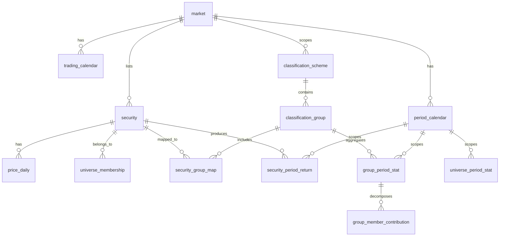

# 02. 도메인 모델 및 데이터 모델

## 1. 레이어 구분

| 레이어 | 성격 | 테이블 |
| --- | --- | --- |
| **마스터** | 외부/자체 공급, 저빈도 변경, 이력 관리 | `market`, `security`, `universe_membership`, `classification_scheme`, `classification_group`, `security_group_map` |
| **원천 시계열** | 일 단위 적재 | `price_daily`, `trading_calendar` |
| **파생(집계)** | 배치로 산출, 재계산 가능 | `period_calendar`, `security_period_return`, `group_period_stat`, `universe_period_stat`, `group_member_contribution` |

파생 레이어는 **언제든 원천으로부터 전량 재생성 가능**해야 한다. 파생 테이블에 수기 보정값을 넣지 않는다.

## 2. ERD



## 3. 마스터 테이블

### 3.1 market

```sql
CREATE TABLE market (
    market_code   VARCHAR(8)   PRIMARY KEY,   -- KR, US
    market_name   VARCHAR(64)  NOT NULL,
    currency      CHAR(3)      NOT NULL,      -- KRW, USD
    timezone      VARCHAR(32)  NOT NULL       -- Asia/Seoul, America/New_York
);
```

### 3.2 security

```sql
CREATE TABLE security (
    security_id     BIGINT       PRIMARY KEY,      -- 내부 불변 식별자
    market_code     VARCHAR(8)   NOT NULL REFERENCES market(market_code),
    board           VARCHAR(16)  NOT NULL,         -- KOSPI, KOSDAQ, NYSE, NASDAQ
    ticker          VARCHAR(16)  NOT NULL,         -- KR: 6자리 단축코드 / US: 심볼
    isin            VARCHAR(12),
    name_local      VARCHAR(128) NOT NULL,
    name_en         VARCHAR(128),
    security_type   VARCHAR(16)  NOT NULL,         -- COMMON, PREFERRED, ETF, REIT, SPAC, DR, OTHER
    listing_date    DATE,
    delisting_date  DATE,                          -- NULL이면 상장 유지
    currency        CHAR(3)      NOT NULL,
    UNIQUE (market_code, ticker, listing_date)
);
CREATE INDEX ix_security_type ON security(market_code, security_type);
```

- `security_id`는 티커 변경·사명 변경과 무관하게 유지한다. 티커 재사용(다른 기업이 동일 코드를 부여받는 경우)을 구분해야 하므로 티커 단독으로 유일키를 두지 않는다.
- 티커/사명 변경 이력이 필요하면 `security_alias(security_id, ticker, name, valid_from, valid_to)`를 별도 운영한다.

### 3.3 universe_membership

유니버스 편입 이력. KR은 마스터 조건에서 일 단위로 생성하고, US는 지수 구성종목 공급 데이터로 적재한다.

```sql
CREATE TABLE universe_membership (
    universe_code VARCHAR(16) NOT NULL,   -- KR_COMMON, US_SP500
    security_id   BIGINT      NOT NULL REFERENCES security(security_id),
    valid_from    DATE        NOT NULL,
    valid_to      DATE        NOT NULL DEFAULT DATE '9999-12-31',  -- 종료일 포함
    PRIMARY KEY (universe_code, security_id, valid_from)
);
CREATE INDEX ix_um_asof ON universe_membership(universe_code, valid_from, valid_to);
```

**as-of 조회 규약**: `valid_from <= :as_of AND :as_of <= valid_to`. 구간은 양끝 포함(closed interval)으로 전 테이블에서 통일한다.

`KR_COMMON` 생성 조건 (기준일 as-of):

```
security.market_code = 'KR'
AND security.board IN ('KOSPI','KOSDAQ')
AND security.security_type = 'COMMON'
AND security.listing_date <= :as_of
AND (security.delisting_date IS NULL OR security.delisting_date > :as_of)
```

### 3.4 classification_scheme / classification_group

```sql
CREATE TABLE classification_scheme (
    scheme_code   VARCHAR(24) PRIMARY KEY,   -- WI26, GICS, THEME_AI
    scheme_name   VARCHAR(64) NOT NULL,
    market_code   VARCHAR(8)  NOT NULL REFERENCES market(market_code),
    scheme_type   VARCHAR(8)  NOT NULL,      -- SECTOR, THEME
    is_exclusive  BOOLEAN     NOT NULL,      -- SECTOR=true, THEME=false
    source_note   VARCHAR(256)               -- 예: WI26 준거, 사내 매핑
);

CREATE TABLE classification_group (
    scheme_code   VARCHAR(24) NOT NULL REFERENCES classification_scheme(scheme_code),
    group_code    VARCHAR(24) NOT NULL,
    group_name    VARCHAR(64) NOT NULL,
    group_name_en VARCHAR(64),
    sort_order    INT         NOT NULL DEFAULT 0,
    color_hex     CHAR(7),                   -- 차트 고정 색상
    valid_from    DATE        NOT NULL,
    valid_to      DATE        NOT NULL DEFAULT DATE '9999-12-31',
    PRIMARY KEY (scheme_code, group_code, valid_from)
);
```

- `color_hex`는 **섹터별 고정 색상**을 보장하기 위한 값이다. 조회 조건이나 순위가 바뀌어도 같은 섹터는 항상 같은 색으로 그린다.

### 3.5 security_group_map

자체 제공 분류 매핑의 실체. 시스템의 핵심 입력이다.

```sql
CREATE TABLE security_group_map (
    scheme_code  VARCHAR(24) NOT NULL,
    security_id  BIGINT      NOT NULL REFERENCES security(security_id),
    group_code   VARCHAR(24) NOT NULL,
    valid_from   DATE        NOT NULL,
    valid_to     DATE        NOT NULL DEFAULT DATE '9999-12-31',
    source_batch VARCHAR(64),               -- 적재 배치/파일 식별자
    PRIMARY KEY (scheme_code, security_id, valid_from)
);
CREATE INDEX ix_sgm_asof ON security_group_map(scheme_code, valid_from, valid_to);
```

**무결성 제약**

- `is_exclusive = true` 스킴: 동일 `(scheme_code, security_id)`에 대해 유효기간이 겹치는 행이 2건 이상 존재할 수 없다. 적재 시 검증한다.
- `is_exclusive = false` 스킴(테마): 중복 허용.
- 매핑이 없는 종목은 계산에서 `UNMAPPED` 그룹으로 분리 집계하고, 커버리지 경보 대상으로 삼는다 ([04](04-pipeline.md#5-데이터-품질-검증)).

## 4. 원천 시계열 테이블

### 4.1 trading_calendar

```sql
CREATE TABLE trading_calendar (
    market_code VARCHAR(8) NOT NULL REFERENCES market(market_code),
    trade_date  DATE       NOT NULL,
    is_open     BOOLEAN    NOT NULL,
    PRIMARY KEY (market_code, trade_date)
);
```

### 4.2 price_daily

```sql
CREATE TABLE price_daily (
    security_id    BIGINT        NOT NULL REFERENCES security(security_id),
    trade_date     DATE          NOT NULL,
    close_raw      NUMERIC(20,6) NOT NULL,   -- 무수정 종가
    adj_factor     NUMERIC(20,10) NOT NULL DEFAULT 1.0,  -- 누적 수정계수
    close_adj      NUMERIC(20,6) NOT NULL,   -- close_raw * adj_factor
    shares_listed  BIGINT,                   -- 상장주식수(보통주)
    market_cap     NUMERIC(24,2),            -- close_raw * shares_listed
    volume         BIGINT,
    trade_status   VARCHAR(16)   NOT NULL,   -- NORMAL, SUSPENDED, HALTED, NO_TRADE
    PRIMARY KEY (security_id, trade_date)
);
CREATE INDEX ix_pd_date ON price_daily(trade_date);
```

- `market_cap`은 **무수정 종가 × 상장주식수**로 산출한다. 수정주가로 계산하면 시가총액이 왜곡된다.
- `close_adj`는 수익률 계산 전용이다. 수정계수는 소급 변경될 수 있으므로 변경 감지 시 재계산 트리거를 건다.
- `trade_status = 'SUSPENDED'` 구간은 직전 정상 종가를 캐리포워드하되 상태 값은 유지한다.

## 5. 파생(집계) 테이블

### 5.1 period_calendar

```sql
CREATE TABLE period_calendar (
    market_code  VARCHAR(8)  NOT NULL REFERENCES market(market_code),
    period_type  CHAR(1)     NOT NULL,        -- W, M
    period_id    VARCHAR(10) NOT NULL,        -- 2026-W03 | 2026-01
    period_seq   INT         NOT NULL,        -- 시장/단위별 단조 증가 정렬키
    cal_start    DATE        NOT NULL,        -- 캘린더 시작일
    cal_end      DATE        NOT NULL,        -- 캘린더 종료일
    base_date    DATE,                        -- 직전 기간의 마지막 거래일(가중치 기준일)
    end_date     DATE        NOT NULL,        -- 해당 기간의 마지막 거래일
    trading_days INT         NOT NULL,
    is_closed    BOOLEAN     NOT NULL,        -- 기간 종료 및 확정 여부
    PRIMARY KEY (market_code, period_type, period_id)
);
```

- `period_seq`는 ISO week-year의 연도 경계 문제를 피하기 위한 정렬 전용 정수 키다. 문자열 `period_id` 정렬에 의존하지 않는다.
- 시장별 거래일 캘린더가 다르므로 동일 `period_id`라도 `end_date`는 시장마다 다르다.
- 거래일이 0일인 기간은 행을 생성하지 않는다.

### 5.2 security_period_return

```sql
CREATE TABLE security_period_return (
    universe_code   VARCHAR(16) NOT NULL,
    period_type     CHAR(1)     NOT NULL,
    period_id       VARCHAR(10) NOT NULL,
    security_id     BIGINT      NOT NULL,
    base_close_adj  NUMERIC(20,6),
    end_close_adj   NUMERIC(20,6),
    ret             NUMERIC(18,10),           -- 기간 수익률
    base_market_cap NUMERIC(24,2),            -- 기준일 시가총액(가중치 분자)
    weight_universe NUMERIC(18,12),           -- 유니버스 내 비중
    incl_status     VARCHAR(16) NOT NULL,     -- INCLUDED, NEW_LISTING, DELISTED, NO_BASE_PRICE, SUSPENDED, NO_MCAP
    PRIMARY KEY (universe_code, period_type, period_id, security_id)
);
```

### 5.3 universe_period_stat

```sql
CREATE TABLE universe_period_stat (
    universe_code      VARCHAR(16) NOT NULL,
    period_type        CHAR(1)     NOT NULL,
    period_id          VARCHAR(10) NOT NULL,
    ret                NUMERIC(18,10) NOT NULL,   -- 시가총액 가중 시장 수익률
    ret_equal          NUMERIC(18,10),            -- 동일가중 수익률
    ret_median         NUMERIC(18,10),
    base_market_cap    NUMERIC(24,2)  NOT NULL,
    member_cnt         INT NOT NULL,
    up_cnt             INT NOT NULL,
    unmapped_cap_ratio NUMERIC(9,6),              -- 분류 미매핑 시총 비중(품질 지표)
    is_provisional     BOOLEAN NOT NULL DEFAULT FALSE,
    calc_version       VARCHAR(16) NOT NULL,
    calculated_at      TIMESTAMP NOT NULL,
    PRIMARY KEY (universe_code, period_type, period_id)
);
```

### 5.4 group_period_stat

범프 차트와 기여도 화면의 주 조회 대상. **단일 테이블 조회로 화면이 그려지도록** 비정규화한다.

```sql
CREATE TABLE group_period_stat (
    universe_code      VARCHAR(16) NOT NULL,
    scheme_code        VARCHAR(24) NOT NULL,
    group_code         VARCHAR(24) NOT NULL,
    period_type        CHAR(1)     NOT NULL,
    period_id          VARCHAR(10) NOT NULL,
    period_seq         INT         NOT NULL,

    -- 수익률
    ret                NUMERIC(18,10) NOT NULL,   -- 시총가중 그룹 수익률
    ret_equal          NUMERIC(18,10),            -- 동일가중
    ret_median         NUMERIC(18,10),

    -- 비중/기여도
    base_weight        NUMERIC(18,12),            -- 기준일 유니버스 내 그룹 비중
    contribution       NUMERIC(18,10),            -- base_weight * ret
    contrib_share      NUMERIC(18,10),            -- contribution / universe_ret (가드 적용)

    -- 순위
    rank_ret           INT NOT NULL,              -- 수익률 내림차순 순위
    rank_ret_prev      INT,
    rank_delta         INT,                       -- rank_ret_prev - rank_ret (+면 순위 상승)
    rank_contrib       INT,                       -- 기여도 절대값 기준 순위

    -- 집중도
    member_cnt         INT NOT NULL,
    up_cnt             INT NOT NULL,
    hhi                NUMERIC(12,10),            -- 그룹 내 비중 제곱합
    effective_n        NUMERIC(12,4),             -- 1 / hhi
    top1_contrib_share NUMERIC(12,8),
    top3_contrib_share NUMERIC(12,8),
    top5_contrib_share NUMERIC(12,8),
    cap_weight_spread  NUMERIC(18,10),            -- ret - ret_equal

    is_provisional     BOOLEAN NOT NULL DEFAULT FALSE,
    calc_version       VARCHAR(16) NOT NULL,
    calculated_at      TIMESTAMP NOT NULL,
    PRIMARY KEY (universe_code, scheme_code, group_code, period_type, period_id)
);
CREATE INDEX ix_gps_series
    ON group_period_stat(universe_code, scheme_code, period_type, period_seq);
```

### 5.5 group_member_contribution

드릴다운 전용. 전 종목 저장이 부담이면 **그룹·기간별 상위/하위 N건 + 잔여 합산 행**만 적재한다(기본 정책: 상위 20, 하위 20, 나머지는 `security_id = 0`인 `OTHERS` 합산 행).

```sql
CREATE TABLE group_member_contribution (
    universe_code   VARCHAR(16) NOT NULL,
    scheme_code     VARCHAR(24) NOT NULL,
    group_code      VARCHAR(24) NOT NULL,
    period_type     CHAR(1)     NOT NULL,
    period_id       VARCHAR(10) NOT NULL,
    security_id     BIGINT      NOT NULL,       -- 0 = OTHERS 합산 행
    weight_in_group NUMERIC(18,12) NOT NULL,
    ret             NUMERIC(18,10),
    contribution    NUMERIC(18,10) NOT NULL,    -- weight_in_group * ret
    contrib_rank    INT,
    PRIMARY KEY (universe_code, scheme_code, group_code, period_type, period_id, security_id)
);
```

## 6. 입력 데이터 규격

### 6.1 분류 매핑 파일 (security_group_map 적재)

UTF-8 CSV, 헤더 필수.

```csv
scheme_code,market_code,ticker,group_code,valid_from,valid_to
WI26,KR,005930,WI620,2020-01-01,9999-12-31
WI26,KR,000660,WI620,2020-01-01,9999-12-31
GICS,US,AAPL,45,2020-01-01,9999-12-31
```

| 컬럼 | 규칙 |
| --- | --- |
| `scheme_code` | `classification_scheme`에 사전 등록되어 있어야 함 |
| `market_code` + `ticker` | 적재 시 `security_id`로 해석. 미해석 행이 있으면 배치 실패 |
| `group_code` | `classification_group`에 사전 등록되어 있어야 함. 분류 체계의 공식 코드를 쓴다 ([§7](#7-코드-체계-참고)) |
| `valid_from` / `valid_to` | `YYYY-MM-DD`, 양끝 포함. `valid_to` 생략 시 `9999-12-31` |

**적재 규칙**

- 배치는 **원자적(all-or-nothing)** 이다. 검증 실패 행이 하나라도 있으면 커밋하지 않는다.
- 배타 스킴에서 기존 유효 매핑과 기간이 겹치면, 신규 `valid_from`의 전일로 기존 행의 `valid_to`를 절단(close-out)한 뒤 신규 행을 삽입한다.
- 소급 기간의 매핑이 변경되면 해당 시점 이후 전 기간의 파생 테이블 재계산을 예약한다 ([04](04-pipeline.md#4-재계산-정책)).

### 6.2 S&P 500 구성종목 파일 (universe_membership 적재)

```csv
universe_code,ticker,valid_from,valid_to
US_SP500,AAPL,2015-01-01,9999-12-31
US_SP500,XYZ,2021-03-22,2024-06-14
```

### 6.3 일별 시세 (price_daily 적재)

```csv
market_code,ticker,trade_date,close_raw,adj_factor,shares_listed,volume,trade_status
KR,005930,2026-01-09,71200,1.0,5969782550,12345678,NORMAL
```

`close_adj`와 `market_cap`은 적재 시 계산해 저장한다.

## 7. 코드 체계 참고

- **WI26**: 대분류 26종 / 소분류 48종. 실제 코드·명칭은 수집 데이터 [`data/wi26_classification.csv`](../data/wi26_classification.csv)를 단일 출처로 하며, 이를 `classification_group`에 선등록한다.

  | | | | | | |
  | --- | --- | --- | --- | --- | --- |
  | WI100 에너지 | WI110 화학 | WI200 비철금속 | WI210 철강 | WI220 건설 | WI230 기계 |
  | WI240 조선 | WI250 상사,자본재 | WI260 운송 | WI300 자동차 | WI310 화장품,의류 | WI320 호텔,레저 |
  | WI330 미디어,교육 | WI340 소매(유통) | WI400 필수소비재 | WI410 건강관리 | WI500 은행 | WI510 증권 |
  | WI520 보험 | WI600 소프트웨어 | WI610 IT하드웨어 | WI620 반도체 | WI630 IT가전 | WI640 디스플레이 |
  | WI700 통신서비스 | WI800 유틸리티 | | | | |

  `group_code`는 `WI100` 형식의 원 코드를 그대로 쓴다. 섹터명에 쉼표가 포함되므로(`상사,자본재`) CSV 취급 시 따옴표 처리가 필요하다. 소분류(`WI10010` 등)는 `classification_group`에 하위 레벨로 등록하되, 이번 범위의 집계 단위는 **대분류**다.
- **GICS**: 섹터 11종 / 산업그룹 25종 / 산업 74종 / 소분류 163종. 실제 코드·명칭은 [`data/gics_classification.csv`](../data/gics_classification.csv)(MSCI GICS Methodology 2024-08판에서 생성)를 단일 출처로 한다.

  | | | | |
  | --- | --- | --- | --- |
  | 10 Energy | 15 Materials | 20 Industrials | 25 Consumer Discretionary |
  | 30 Consumer Staples | 35 Health Care | 40 Financials | 45 Information Technology |
  | 50 Communication Services | 55 Utilities | 60 Real Estate | |

  `group_code`는 GICS **공식 숫자 코드**를 그대로 쓴다(`45`, 하위 레벨은 `4530` / `453010` / `45301020`). `INFO_TECH` 같은 별칭 코드는 만들지 않는다. 상위 코드가 하위 코드의 접두어이므로 `VARCHAR`로 저장·비교하고 정수로 변환하지 않는다. 이번 범위의 집계 단위는 **섹터(2자리)** 다.
- 두 체계 모두 **코드 값의 단일 출처는 DB 마스터**이며, 애플리케이션 코드에 하드코딩하지 않는다. 별칭 코드(`SEMICON`, `INFO_TECH` 등)는 두지 않고 공식 코드만 쓴다.
