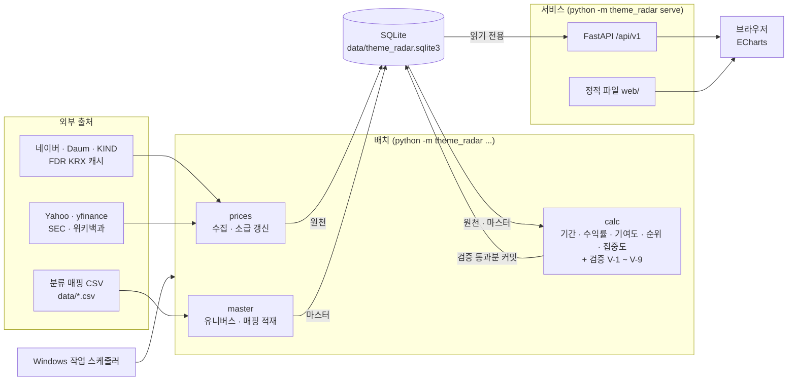

# 09. 기술 스택과 구현 구조

> **작성일: 2026-09-15. 상태: 확정 (2026-09-15).** [01](01-requirements.md) ~ [08](08-library-review.md)에서 정한 요구사항·계산·API·화면·수집 명세를 어떤 기술로 구현할지 정한다. 새 의존성(FastAPI, Uvicorn, pytest, httpx, ECharts) 추가를 확정했으며, 설치는 구현 1단계에서 한다.
>
> **다루지 않는 것:** 테이블 설계. [02](02-domain-and-data-model.md)의 DDL을 SQLite 타입으로 옮기는 작업은 별도 단계에서 한다 ([§10](#10-구현-순서)).

## 1. 전제

| 전제 | 근거 |
| --- | --- |
| 사용자 1명이 이 PC(Windows 10)에서 운영한다 | [07 §10.1](07-price-ingestion.md#101-실행-시각) 작업 스케줄러 운영 |
| 내부 분석 용도다. 대시보드를 외부에 공개하지 않는다 | [07 §12](07-price-ingestion.md#12-그-밖의-고려사항) 3항 이용약관 |
| 데이터가 작다. `price_daily`는 2026-09 기준 약 135만 행(추정), 연 약 73만 행 증가. `group_period_stat`은 연 수천 행 | [04 §6.1](04-pipeline.md#61-데이터-규모-추정), 07 §10.2 종목 수 |
| 계산과 조회를 나눈다. API는 파생 테이블을 읽기만 한다 | [04 §1](04-pipeline.md#1-구성-요소) |
| 주가 수집은 `.venv`에서 yfinance·FinanceDataReader를 쓰고 SQLite에 적재한다 | [07 §5.3](07-price-ingestion.md#53-실행-환경), [§6](07-price-ingestion.md#6-저장소-스키마) |
| 기존 스크립트는 모두 Python이고 Python으로 유지보수한다 | `scripts/*.py` |
| 환경: Python 3.12.7(pyenv), 내장 SQLite 3.45.3. Node.js는 없다 | 2026-09-15 확인 |

## 2. 결론 요약

| 영역 | 선택 | 이유 |
| --- | --- | --- |
| 언어 | **Python 3.12** (배치·API 전부) | 기존 스크립트·수집 모듈과 같은 언어 |
| DB | **SQLite** 파일 1개 `data/theme_radar.sqlite3` (WAL 모드) | 1인·로컬·수백만 행 규모. 설치·운영할 DB 서버가 없다 |
| DB 접근 | 표준 라이브러리 `sqlite3` + SQL. ORM 없음 | 02가 SQL로 정의돼 있고, 조회는 비정규화 테이블 단순 조회다 |
| 계산 엔진 | 표준 라이브러리만 사용 (`math.fsum`, `statistics`, `datetime`) | [03 §13](03-metrics-spec.md#13-참조-구현-의사코드) 참조 구현과 1:1로 대응한다 |
| 주가 수집 | yfinance 1.7.0, FinanceDataReader 0.9.202 | 07·08 결정 그대로 |
| API 서버 | **FastAPI + Uvicorn**, `127.0.0.1` 전용 | 05의 파라미터 검증과 응답 형식을 선언으로 고정한다 |
| 화면 | **빌드 없는 HTML + JavaScript 모듈**, FastAPI가 함께 서빙 | Node.js·빌드 도구 없이 화면 1개를 만든다 |
| 차트 | **Apache ECharts** (파일로 동봉) | 06 §3 범프 차트 요구 대부분이 내장 기능이다 |
| 배치 실행 | Windows 작업 스케줄러 + CLI | 07 §10.1과 같다 |
| 설정 | TOML (`tomllib`, 표준 라이브러리) | 임계값 외부화 ([03 §9.5](03-metrics-spec.md#95-판정-가이드-ui-배지용)) |
| 테스트 | pytest (+ httpx) | 07 §9.5 사례 표를 매개변수화 테스트로 옮기기 쉽다 |
| 의존성 관리 | 프로젝트 루트 `.venv` 하나, 버전 고정 + 잠금 파일 | 07 §5.3과 같다 |

## 3. 전체 구조



- 프로세스는 두 종류다. 작업 스케줄러가 띄우는 **배치 CLI**와 상시 떠 있는 **서비스(API + 화면)** 다. 둘은 같은 Python 패키지와 같은 DB 파일을 쓴다.
- 배치와 서비스 사이에 큐·캐시 서버를 두지 않는다. 연결 고리는 DB 파일 하나다.

## 4. 영역별 선택

### 4.1 DB: SQLite

**선택 이유**

- 규모가 작다. 범프 차트 104주 조회는 `group_period_stat` 2,704행(26섹터 × 104주)이고, 인덱스 범위 조회로 끝난다.
- 사용자가 1명이고 쓰기는 배치만 한다. 동시 쓰기 경합이 없다.
- DB 서버를 설치·기동·백업하는 운영 부담이 없다. 파일 복사로 백업한다.
- 07이 이미 수집 저장소로 SQLite를 정했다. 원천과 파생을 같은 파일에 두면 계산 시 조인이 단순하다.
- 내장 SQLite 3.45.3은 윈도 함수(순위 계산), `RETURNING`, `STRICT` 테이블을 지원한다.

**운영 규칙**

| 항목 | 규칙 |
| --- | --- |
| 파일 | `data/theme_radar.sqlite3` 하나. 원천·마스터·파생·운영 메타데이터를 함께 둔다. git에서 제외한다 |
| 연결 설정 | `journal_mode=WAL`, `foreign_keys=ON`, `busy_timeout=30000`을 연결마다 적용한다 (`theme_radar/db/connection.py`) |
| 트랜잭션 | 연결은 자동 커밋 모드로 연다. 여러 문장을 쓰는 작업은 `transaction()`으로 묶으며 `BEGIN IMMEDIATE`로 쓰기 잠금을 먼저 잡는다 |
| 읽기 연결 | API는 `file:...?mode=ro` URI로 연다. API 코드에서 쓰기가 일어날 수 없다 |
| 스키마 변경 | `theme_radar/db/migrations/NNNN_설명.sql` 번호순 SQL 파일이 테이블 정의의 단일 출처다. 파일 하나를 한 트랜잭션으로 적용하고, 적용 번호는 `PRAGMA user_version`으로 관리한다. 마이그레이션 도구는 쓰지 않는다 |
| 숫자·날짜 | [02 §1.1](02-domain-and-data-model.md#11-저장-규약) 저장 규약을 따른다 |
| 백업 | **지금은 파일 복사로 한다**(T-13). 상장폐지 종목 이력처럼 출처에서 사라지는 데이터가 있어 DB는 다시 받을 수 없는 자산이다. 무인 운영으로 넘어갈 때 `sqlite3.Connection.backup()`으로 날짜별 사본을 만들고 주간 대사(07 §9.4) 뒤에 실행한다. 보관 위치와 개수는 그때 정한다 |

**전량 재계산과 배포 차단**

04 초안의 blue-green 전환은 SQLite 트랜잭션으로 대신한다([04 §4](04-pipeline.md#4-재계산-정책)에 반영).

- 파생 결과는 기간 하나를 한 트랜잭션으로 쓴다. 한 기간의 검증이 실패해도 다른 기간은 저장된다.
- 트랜잭션 안에서 V-1 ~ V-7을 검사한다. 통과하면 커밋하고, 위반하면 롤백한 뒤 `batch_run`을 `FAILED`로, 위반 내용을 `validation_result`에 남긴다. V-8, V-9는 경고로 기록하고 커밋한다.
- WAL 모드에서 API는 커밋 전까지 이전 값을 읽는다. 따라서 검증에 실패한 값은 화면에 나가지 않는다([03 §12](03-metrics-spec.md#12-검증-규칙)). 한 번도 계산에 성공하지 못한 기간은 행이 없으므로 API가 409 `NOT_AVAILABLE`을 준다.
- 재계산 요청은 DB 테이블에 쌓고 `aggregate` 시작 시 기간 오름차순으로 처리한다. 요청이 남아 있는 구간의 API 응답은 `stale = true`다.

### 4.2 계산 엔진: 표준 라이브러리

- 03 §13 참조 구현이 이미 순수 Python 형태다. 명세와 코드를 줄 단위로 대조할 수 있게 그대로 옮긴다.
- 기간 하나의 계산량은 KR 약 2,400종목 × 스킴 수 수준의 산술이다. 표준 라이브러리로 충분하다고 본다. 전량 재계산 소요 시간은 미측정이며, [§10](#10-구현-순서) 3단계에서 측정해 [04 §6.3](04-pipeline.md#63-목표) 목표(2시간)와 비교한다.
- 비중 합·기여도 합은 `math.fsum`으로 더한다. V-1 ~ V-4의 허용오차 1e-9를 부동소수점 누적 오차 없이 맞춘다.
- pandas는 `.venv`에 설치되지만(yfinance·FDR 의존성) 계산 엔진에서는 쓰지 않는다. 라이브러리 버전 변화가 계산값에 영향을 주지 않게 한다. 수집 어댑터 안에서만 쓴다([07 §4](07-price-ingestion.md#4-설계-원칙) 6항).
- ISO 주차는 `date.isocalendar()`로 구한다. `period_seq` 정렬 규칙([03 §1.1](03-metrics-spec.md#11-iso-week-주의사항))을 따른다.

### 4.3 API: FastAPI + Uvicorn

**선택 이유**

- 05의 파라미터 규칙(열거값, 기간 식별자 형식, `limit` 상한)을 타입 선언으로 검증한다.
- 응답 모델을 선언해 05의 응답 형식을 코드로 고정한다.
- `/docs`에 OpenAPI 문서가 자동으로 생긴다. 구현을 05 명세와 대조하는 데 쓴다.
- API와 화면 정적 파일을 한 프로세스, 같은 origin에서 서빙한다. CORS 설정이 필요 없다.

**구현 규칙**

| 항목 | 규칙 |
| --- | --- |
| 바인딩 | `127.0.0.1:8000`. 인증을 두지 않으므로 외부 인터페이스에 열지 않는다 |
| 핸들러 | 동기 함수(`def`)로 쓴다. 요청마다 읽기 전용 SQLite 연결을 연다 |
| 오류 봉투 | 예외 핸들러로 [05 §1.3](05-api-spec.md#13-오류-응답) 형식을 통일한다. FastAPI 기본 검증 오류(422)는 400 `INVALID_PARAMETER`로 바꾼다 |
| 캐시 | [05 §7](05-api-spec.md#7-캐싱)의 `Cache-Control`·`ETag` 헤더만 붙인다. 서버 측 캐시와 캐시 예열 작업(04 초안의 `cache-warm`)은 두지 않는다 |
| 조회 SQL | `api/queries.py`에 모은다. API는 계산하지 않는다 |
| CSV 내보내기 | 표준 라이브러리 `csv`로 만든다 |

**검토한 대안**

| 대안 | 채택하지 않은 이유 |
| --- | --- |
| Flask | 가볍지만 파라미터 검증·오류 형식·문서를 직접 만들어야 한다 |
| 표준 라이브러리 `http.server` | 라우팅, 검증, 캐시 헤더, 정적 파일 서빙을 모두 직접 구현해야 한다 |
| Django | ORM·관리자 화면 등 이 시스템이 쓰지 않는 기능이 대부분이다 |

### 4.4 화면: 빌드 없는 HTML + JavaScript 모듈

**선택 이유**

- 화면은 대시보드 1개다([06 §1](06-ui-spec.md#1-화면-구성)). 프레임워크와 빌드 파이프라인이 주는 이득보다 Node.js 설치·패키지 관리·빌드 유지 비용이 크다.
- 06의 상호작용은 대부분 차트 라이브러리 기능이다([§4.5](#45-차트-apache-echarts)). 화면 코드에 남는 일은 API 호출, 상태 관리, 패널 갱신, 표기 형식이다.
- 브라우저가 ES 모듈을 직접 읽으므로 파일을 고치고 새로 고치면 바로 반영된다.

**구현 규칙**

| 항목 | 규칙 |
| --- | --- |
| 상태 | URL 쿼리스트링이 화면 상태의 단일 출처다([06 §2](06-ui-spec.md#2-컨트롤-바)). 컨트롤 변경 → URL 갱신 → 패널 재조회 순서로만 흐른다 |
| 모듈 | `state.js`(URL ↔ 상태), `api.js`(호출·오류·`stale`), `format.js`(%, bp, 조/억원, $B), 패널별 모듈 3개 |
| 색상 | 섹터 색은 `/meta/groups`의 `color`만 쓴다. 상승·하락 색은 시장별 설정값([06 §4](06-ui-spec.md#4-기간-스냅샷-패널)) |
| 타입 점검 | 파일 첫 줄 `// @ts-check`와 JSDoc 타입 주석. VS Code 내장 기능으로 동작해 Node.js가 필요 없다 |
| MIME 타입 | 윈도는 레지스트리 설정에 따라 `.js`를 `text/plain`으로 판정할 수 있고, 그러면 브라우저가 모듈 로드를 거부한다. 서버 시작 시 `mimetypes.add_type("text/javascript", ".js")`를 등록한다 |
| 외부 네트워크 | CDN을 쓰지 않는다. 라이브러리 파일은 `web/vendor/`에 버전을 파일명에 넣어 둔다 |
| 캐시 | 화면 파일은 `Cache-Control: no-cache`로 준다. 파일 이름이 그대로라, 캐시 지시가 없으면 브라우저가 `Last-Modified`로 신선도를 추정해 새로 고쳐도 HTML만 새로 받고 JS 모듈은 옛 것을 쓴다(2026-09-16 섹터 시가총액 차트를 더한 뒤 실제로 차트가 나오지 않았다). 매번 `ETag`로 확인하고, 바뀌지 않았으면 304다 |

**검토한 대안**

| 대안 | 채택하지 않은 이유 |
| --- | --- |
| React + TypeScript + Vite | Node.js 설치와 빌드가 필요하다. 화면 1개 규모에 비해 도구 유지 비용이 크다 ([§9](#9-재검토-조건)에 전환 조건) |
| Streamlit | Python만으로 만들 수 있지만 06 §3.2의 선 hover 강조·선 클릭 고정 선택·URL 상태 공유를 구현하기 어렵다 |
| Plotly Dash | 콜백으로 대부분 가능하지만, 차트가 Plotly라 hover 강조·끝단 라벨 겹침 회피를 직접 만들어야 한다. API(05)를 거치지 않는 구조가 되기 쉽다 |
| Jinja2 서버 렌더링 + HTMX | 차트는 어차피 JavaScript다. 화면이 JSON API를 쓰는 구조에서 서버 렌더링을 섞을 이유가 적다 |

### 4.5 차트: Apache ECharts

[06 §3](06-ui-spec.md#3-범프-차트-메인) 범프 차트 요구와 ECharts 기능의 대응이다. 5단계에서 실데이터로 확인했고, 어긋난 셋은 아래 표에 고친 내용을 적었다.

| 06 요구 | ECharts 기능 |
| --- | --- |
| 1위가 최상단 | `yAxis.inverse: true` |
| 선 hover 시 강조, 나머지 감쇠 | `emphasis.focus: 'series'`와 `blur` 상태 스타일 |
| 오른쪽 끝 그룹명 라벨, 겹침 회피 | 라인 시리즈 `endLabel` + `labelLayout.moveOverlap: 'shiftY'`. **`shiftY`만으로는 부족했다.** 수익률 모드처럼 값이 한곳에 몰리면 `shiftY`가 라벨을 그리드 밖으로 밀어내고 `hideOverlap`도 걸리지 않는다. 마지막 값을 픽셀로 바꿔 최소 간격(13px)을 지키는 계열만 라벨을 켠다 (`web/js/bump-chart.js`의 `fittingLabels`) |
| 결측 기간은 선을 끊는다 | 결측 기간을 `null`로 채우고 `connectNulls: false`. API는 점을 생략하므로(05 §3.1) 화면에서 기간 배열에 맞춰 `null`을 채운다 |
| 범례 클릭 표시/숨김 | `legend` 기본 동작 |
| x축 드래그 확대, 더블클릭 초기화 | `dataZoom`. 초기화는 더블클릭 이벤트에서 `dispatchAction`으로 처리한다 |
| 선·점 클릭 → 드릴다운 | `chart.on('click', ...)` |
| 수익률 부호별 점 테두리 | 데이터 항목별 `itemStyle.borderType` (`solid` / `dashed`). **선 계열의 기본 심볼은 `emptyCircle`이라** 항목별 `symbol: 'circle'`을 함께 줘야 채워진다. 채운 점의 테두리 색은 배경색이어서 겹친 점이 떨어져 보인다 |
| 잠정 기간 점선 | 구간별 선 스타일은 내장 기능이 없다. **겹쳐 그리면 실선이 비쳐 점선으로 보이지 않아서**, 확정 구간과 잠정 구간을 서로 다른 계열로 나누고 이음매 한 점만 양쪽에 둔다. 두 계열의 `name`이 같으므로 범례 토글은 한 번에 걸린다 |
| 순위 ↔ 수익률 y축 전환 | `setOption`으로 축과 데이터를 교체한다 |
| 표 형태 대체 표현 | 내장 기능을 쓰지 않고 같은 데이터로 `<table>`을 만든다 ([06 §8](06-ui-spec.md#8-접근성-및-반응형)) |

| 대안 | 채택하지 않은 이유 |
| --- | --- |
| Plotly.js | hover 시 다른 선 감쇠, 끝단 라벨 겹침 회피가 내장돼 있지 않다 |
| D3 | 모든 요소를 직접 구현해야 한다 |
| Chart.js | 범프 차트에 필요한 라벨 배치·축 반전·확대 기능을 플러그인으로 보태야 한다 |

### 4.6 배치 실행과 운영

**CLI**

진입점은 `python -m theme_radar` 하나다. 07 §5.2의 수집 명령은 `prices` 하위 명령이 된다.

```bash
.venv\Scripts\python -m theme_radar init-db                    # 마이그레이션 적용
.venv\Scripts\python -m theme_radar prices daily --market KR   # 07 §5.2 명령 (접두어만 바뀜)
.venv\Scripts\python -m theme_radar load-mapping --scheme WI26 # 분류 매핑 적재 (02 §6.1)
.venv\Scripts\python -m theme_radar aggregate --market KR      # 기간 확정 → 집계 → 검증 → 커밋
.venv\Scripts\python -m theme_radar daily --market KR          # prices daily + aggregate. 작업 스케줄러가 부른다
.venv\Scripts\python -m theme_radar recalc                     # 쌓인 재계산 요청 처리
.venv\Scripts\python -m theme_radar status                     # 데이터 최신 여부, 최근 실행, 경고, 할 일
.venv\Scripts\python -m theme_radar serve                      # API + 화면, http://127.0.0.1:8000
```

**실행 방식: 지금은 수동이다** (2026-09-16 결정, [T-13](#8-결정-기록))

서버에 올려 서비스로 돌릴 계획이 없고, 볼 일이 있을 때만 켜서 본다. 그래서 작업 스케줄러 등록과
자동 백업은 만들지 않았다. 아래 "일일 흐름"은 무인 운영으로 전환할 때 쓸 설계로 남겨 둔다.

수동으로 쓸 때의 흐름은 두 줄이다. 볼 때마다 이 순서로 한다.

```bash
.venv\Scripts\python -m theme_radar status                     # 데이터가 최신인지, 뭘 먼저 돌려야 하는지
.venv\Scripts\python -m theme_radar daily --market KR          # status가 시키면 실행한다
.venv\Scripts\python -m theme_radar serve                      # 화면을 띄운다
```

`status`는 판단을 대신하지 않고 관측값(가격이 어디까지 들어왔나, 최근 거래일은 언제인가, 집계가
어느 기간까지인가, 재계산 대기가 있나)과 거기서 나오는 할 일만 보여 준다. 할 일이 비어 있으면
그대로 `serve`로 본다.

- 백업은 `data/theme_radar.sqlite3` 파일을 복사하는 것으로 갈음한다. 폐지 종목 이력처럼 출처에서
  사라지는 데이터가 있어 이 파일은 다시 받을 수 없다([§4.2](#42-저장소-sqlite)). 자동화는 무인 운영으로
  넘어갈 때 만든다.

**일일 흐름** (무인 운영으로 전환할 때 쓴다. 지금은 쓰지 않는다)

| 시각 (KST) | 명령 | 단계 |
| --- | --- | --- |
| 거래일 18:00 | `daily --market KR` | 수집(07 §7.5) → 기간 확정 → W·M 집계(진행 중 기간은 잠정치) → 검증 → 커밋 |
| 다음 날 08:00 | `daily --market US` | 수집(07 §8) → 이하 같음 |
| 토요일 | `prices reconcile` → `recalc` → `backup` | 전 구간 대사(07 §9.4), 소급 변경분 재계산, 백업 |
| 파일 도착 시 | `load-mapping` → `recalc` | 분류 매핑 적재, 영향 기간 재계산 |

- 04 §2의 `ingest-*`, `period-close`, `aggregate`, `validate`는 각각 함수로 두고 `daily`가 순서대로 부른다. 앞 단계가 실패하면 뒤 단계를 실행하지 않는다.
- 작업 스케줄러 등록 방식은 07 §10.1과 같다(`.cmd` 파일에서 `cd /d` 후 실행).
- KR·US 배치 시각이 겹치지 않으므로 쓰기 충돌은 `busy_timeout`으로 충분하다.

**알림**

[04 §5.3](04-pipeline.md#53-상시-모니터링-지표)의 알림은 메일·메신저로 보내지 않는다.

- 모든 작업은 `batch_run`, `validation_result`([04 §7](04-pipeline.md#7-운영-메타데이터))에 결과를 남기고, 실패하면 0이 아닌 종료 코드로 끝난다.
- `status` 명령이 최근 실행, 실패, 경고를 한 화면에 보여 준다. 경고는 **가장 최근 실행이 남긴 것만** 센다. 지난 실행에서 이미 해결된 경고까지 누적하면 목록이 늘기만 하고 점검 대상이 되지 못한다.
- 로그는 표준 라이브러리 `logging`으로 `logs/`에 작업별로 남긴다.

### 4.7 설정

| 파일 | 내용 | git |
| --- | --- | --- |
| `config.toml` | 배지 임계값(03 §9.5), 검증 경고 임계값(V-8, V-9), `SHARE_CHANGE` ±5%(07 §11.2), 요청 속도(07 §10.2), 파일 경로 | 포함 |
| `config.local.toml` | SEC User-Agent 연락처(07 §8.3), 백업 보관 위치 등 개인 값. `config.toml` 값을 덮어쓴다 | 제외 |

API 키·비밀번호는 없다(07 R-3).

### 4.8 테스트

| 층 | 대상 | 방법 |
| --- | --- | --- |
| 계산 단위 | 03의 공식·예외 | 종목 몇 개짜리 합성 데이터와 손으로 계산한 기대값. 경쟁 순위 동점, `contrib_share` 0 근처 가드, `G_plus = 0`, `incl_status` 판정, ISO 주 연도 경계를 포함한다 |
| 수집 회귀 | 07 §9.5 사례 13건 | 저장해 둔 출처 응답 원문으로 오프라인 실행한다. 라이브러리 버전을 올릴 때 반드시 통과한다 |
| API | 05 응답 형식·오류 코드 | FastAPI `TestClient`(httpx 필요)와 테스트용 SQLite 파일 |
| 실데이터 | 전 기간 결과 | 배치의 V-1 ~ V-9가 맡는다 |
| 화면 | 06 요구 | 자동 테스트는 두지 않는다. 06 §3·§6 항목을 체크리스트로 확인한다 |

## 5. 의존성

| 구분 | 패키지 | 쓰는 곳 | 버전 |
| --- | --- | --- | --- |
| 실행 | yfinance | `prices` (US) | 1.7.0 (07 §5.3) |
| 실행 | finance-datareader | `prices` (KR 일부) | 0.9.202 (07 §5.3) |
| 실행 | fastapi | `api` | 0.141.1 |
| 실행 | uvicorn | `serve` | 0.53.0 |
| 개발 | pytest | `tests` | 9.1.1 |
| 개발 | httpx | API 테스트 (`TestClient`) | 0.28.1 |
| 화면 | Apache ECharts | `web/vendor/` | 5단계 착수 시 최신 안정판으로 고정 |

- 가상환경은 프로젝트 루트 `.venv` 하나다. `requirements.txt`(실행 직접 의존성), `requirements-dev.txt`(개발), `requirements.lock`(`pip freeze` 결과)을 둔다.
- 2026-09-15 설치 결과 잠금 파일의 패키지는 49개다(pip 제외). yfinance·FinanceDataReader 쪽 32개는 [08 §5](08-library-review.md#5-공통-영향)의 버전과 같다.
- 계산 엔진(`calc`)과 DB 계층(`db`)은 표준 라이브러리만 import한다.
- 기존 일회성 스크립트(`scripts/fetch_wi26.py` 등)는 지금처럼 표준 라이브러리만 쓰고 전역 Python으로도 실행된다.

## 6. 저장소 구조

```
theme-radar/
├── theme_radar/                 # 애플리케이션 패키지
│   ├── __main__.py              # CLI 진입점
│   ├── config.py                # config.toml + config.local.toml
│   ├── jobs.py                  # daily 등 작업 연결, batch_run 기록
│   ├── db/
│   │   ├── connection.py        # 연결 설정(WAL, foreign_keys, busy_timeout), 트랜잭션
│   │   ├── migrate.py           # 마이그레이션 적용 (PRAGMA user_version)
│   │   └── migrations/          # 0001_init.sql, ... 테이블 정의의 단일 출처
│   ├── prices/                  # 주가 수집 모듈. 내부 구성은 07 §5.1과 같다 (store.py의 스키마 생성만 db/로 이동)
│   ├── master/                  # 분류 체계·매핑·유니버스 적재 (02 §6)
│   ├── calc/
│   │   ├── periods.py           # period_calendar (03 §1)
│   │   ├── returns.py           # 종목 수익률, 포함 판정 (03 §2, §10)
│   │   ├── groups.py            # 시장·그룹 수익률, 기여도, 집중도 (03 §4 ~ §9)
│   │   ├── ranks.py             # 경쟁 순위, rank_delta (03 §6)
│   │   ├── validate.py          # V-1 ~ V-9 (03 §12)
│   │   └── recalc.py            # 재계산 요청 처리 (04 §4)
│   └── api/
│       ├── app.py               # FastAPI 앱, 오류 봉투, 캐시 헤더, 정적 파일 마운트
│       ├── routes/              # meta, sectors, market, securities, export (05 §2 ~ §6)
│       └── queries.py           # 조회 SQL
├── web/
│   ├── index.html
│   ├── css/app.css
│   ├── js/
│   │   ├── main.js              # 초기화, 패널 연결
│   │   ├── state.js             # URL 쿼리스트링 ↔ 화면 상태 (06 §2)
│   │   ├── api.js               # 호출, 오류·stale 처리 (06 §6)
│   │   ├── format.js            # 표기 규칙 (06 §7)
│   │   ├── bump-chart.js        # 범프 차트 (06 §3)
│   │   ├── snapshot.js          # 기간 스냅샷 (06 §4)
│   │   └── drilldown.js         # 드릴다운 (06 §5)
│   └── vendor/                  # echarts-<버전>.min.js
├── scripts/                     # 기존 일회성 수집 스크립트 (표준 라이브러리)
├── tests/
│   ├── calc/
│   ├── prices/
│   └── api/
├── data/                        # CSV·원본. theme_radar.sqlite3, raw/prices/, cache/는 git 제외
├── logs/                        # git 제외
├── docs/
├── config.toml
├── config.local.toml            # git 제외
├── requirements.txt
├── requirements-dev.txt
└── requirements.lock
```

- 수집 모듈을 `scripts/prices/`(07 §5.1)에서 `theme_radar/prices/`로 옮긴다. 스키마·설정·CLI·DB 연결을 한 패키지에서 관리하기 위해서다. 아직 구현 전이라 옮기는 비용은 문서 수정뿐이다.
- 모듈 이름은 07 §5.1 규칙대로 표준 라이브러리·설치 패키지 이름(`http`, `calendar`, `fastapi` 등)과 겹치지 않게 한다.

## 7. 기존 문서에서 바뀐 점

아래 변경은 2026-09-15에 04·07 문서에 반영했다.

| 문서 | 기존 | 이 문서 |
| --- | --- | --- |
| [04 §1](04-pipeline.md#1-구성-요소), [§6.2](04-pipeline.md#62-조회-경로) | API 서버 + 캐시 | 서버 측 캐시 없음. HTTP 캐시 헤더만 |
| [04 §2](04-pipeline.md#2-배치-스케줄) | `cache-warm` 작업 | 두지 않음 |
| [04 §4](04-pipeline.md#4-재계산-정책) | `calc_version` 변경 시 blue-green 전환 | 조합 단위 트랜잭션, 검증 통과 시 커밋 ([§4.1](#41-db-sqlite)) |
| [04 §5.3](04-pipeline.md#53-상시-모니터링-지표) | 알림 | `batch_run` 기록, 종료 코드, `status` 명령 |
| [07 §5.1](07-price-ingestion.md#51-파일-구성), [§5.2](07-price-ingestion.md#52-명령) | `scripts/prices/`, `python -m scripts.prices ...` | `theme_radar/prices/`, `python -m theme_radar prices ...` |
| [07 §6](07-price-ingestion.md#6-저장소-스키마) | `data/prices.sqlite3` | `data/theme_radar.sqlite3` (원천·파생 한 파일) |

## 8. 결정 기록

2026-09-15 확정. 판단 기준은 "1인·로컬 운영에 맞게 단순하게, 명세(01 ~ 07)를 그대로 옮길 수 있게"다.

| # | 항목 | 결정 | 이유 |
| --- | --- | --- | --- |
| T-1 | 언어 | Python 3.12 | 기존 코드와 같은 언어. Python으로 유지보수한다 |
| T-2 | DB | SQLite 파일 1개, WAL | 규모·사용자 수에 비해 DB 서버는 운영 부담만 늘린다 |
| T-3 | DB 접근 | `sqlite3` + SQL, ORM·마이그레이션 도구 없음 | 스키마가 SQL로 정의돼 있고 조회가 단순하다 |
| T-4 | 계산 엔진 | 표준 라이브러리만 | 03 참조 구현과 1:1. 라이브러리 변화가 계산값에 닿지 않는다 |
| T-5 | API | FastAPI + Uvicorn, 로컬 전용 | 05 검증·형식을 선언으로 고정한다 |
| T-6 | 화면 | 빌드 없는 HTML + JS 모듈 | Node.js 없이 화면 1개를 만든다 |
| T-7 | 차트 | Apache ECharts | 06 §3 요구 대부분이 내장 기능이다 |
| T-8 | 캐시 | 서버 캐시 없음 | 조회 대상이 수천 행 이하다 |
| T-9 | 배포 차단 | 트랜잭션 + 검증 후 커밋 | blue-green과 같은 효과를 추가 구조 없이 얻는다 |
| T-10 | 배치·알림 | 작업 스케줄러 + CLI, 기록과 `status` 명령 | 1인 로컬 운영 |
| T-11 | 수집 모듈 위치 | `theme_radar/prices/` | 스키마·설정을 한곳에서 관리한다 |
| T-12 | 테스트 | pytest + httpx | 사례 표를 매개변수화 테스트로 옮긴다 |
| T-13 | 실행 방식 | **수동 실행.** 작업 스케줄러 등록과 자동 백업은 만들지 않는다 (2026-09-16) | 서버에 올려 서비스로 돌릴 계획이 없다. 볼 일이 있을 때 켜서 본다. 무인 운영이 아니면 스케줄러·자동 백업은 유지할 대상만 늘린다. 대신 `status`가 "지금 최신인가, 뭘 먼저 돌려야 하나"에 답한다 |

## 9. 재검토 조건

| 상황 | 조치 |
| --- | --- |
| 대시보드를 다른 사람에게 공개하거나 여러 명이 쓰게 된다 | 이용약관 검토(07 §12 3항)를 먼저 한다. 그다음 PostgreSQL, 인증, 서버 배포를 함께 검토한다 |
| 전량 재계산이 04 §6.3 목표(2시간)를 넘는다 | 느린 단계만 SQL 윈도 함수나 NumPy로 바꾼다. 계산 결과는 기존 테스트로 대조한다 |
| SQLite 잠금 대기로 배치가 반복 실패한다 | 작업 시각을 분리한다. 그래도 발생하면 PostgreSQL을 검토한다 |
| 화면이 여러 페이지로 늘어 상태 관리가 복잡해진다 (특이사항 목록 화면 등) | React + TypeScript + Vite 전환을 검토한다. API는 그대로 둔다 |
| ECharts 프로토타입에서 06 §3 필수 요소(hover 강조, 끝단 라벨)를 충족하지 못한다 | 해당 요소만 직접 구현하거나 D3를 검토한다 |
| 매일 보게 되거나, 며칠 손대지 않아도 최신이길 바라게 된다 | T-13을 뒤집는다. 작업 스케줄러 등록(07 §10.1)과 `backup` 명령을 만든다. 보관 위치는 그때 정한다 |

## 10. 구현 순서

| 단계 | 내용 | 완료 기준 | 상태 |
| --- | --- | --- | --- |
| 1. 기반 | 테이블 설계(02 DDL의 SQLite 이식, 07 §6 추가 테이블 반영), `.venv`·의존성 고정, 패키지 골격, 설정, DB 연결·마이그레이션, CLI | `init-db`로 빈 DB가 만들어진다 | 완료 (2026-09-15) |
| 2. 수집·마스터 | 07 수집 모듈, 분류 체계·매핑·유니버스 적재 | 2025-01-01 이후 백필 완료, C-1 ~ C-13 차단 항목 통과 | 완료 (2026-09-16) |
| 3. 계산 | 기간 확정, 집계, 검증, 재계산 요청 처리 | 전 기간 V-1 ~ V-7 통과, 합성 데이터 테스트 통과, 전량 재계산 시간 측정 | 완료 (2026-09-16) |
| 4. API | 05 엔드포인트 | 05 예시와 같은 형식, 04 §6.3 응답 시간 목표 | 완료 (2026-09-16) |
| 5. 화면 | ECharts 범프 차트 프로토타입 → 06 전체 | 06 §3 필수 요소와 §6 상태 처리 확인 | 완료 (2026-09-16) |
| 6. 운영 | `status` | `status`가 할 일을 정확히 짚는다 | 완료 (2026-09-16) |
| (앞으로) | C-8 표본 교차검증 | 바깥 출처와 대조해 파이프라인 전체가 일관되게 틀린 경우를 잡는다 | [07 §11.3](07-price-ingestion.md#113-c-8-표본-교차검증-앞으로-할-일)에 할 일로 기록 |
| (보류) | 작업 스케줄러 등록, 자동 백업 | 1주 무인 운영에서 `daily` 실패 없음 | 무인 운영으로 전환할 때 (T-13) |

- 패키지 골격은 단계마다 쓰는 모듈만 만든다. 1단계에서는 `config.py`, `__main__.py`(`init-db`), `db/`를 만들었다. `prices/`, `master/`, `calc/`, `api/`, `web/`은 해당 단계에서 추가한다.
- 1단계의 테이블 설계 결정은 [02 §9](02-domain-and-data-model.md#9-결정-기록)에 기록했다.
- 4단계 실측 응답 시간(실데이터, 로컬): 범프 차트 52주·26섹터 p95 149ms, 스냅샷 54ms, 드릴다운 55ms, 특이사항 57ms (04 §6.3 목표 300ms·200ms).
- 3단계 전량 재계산은 2025-01 이후 109개 기간 기준 KR 10초 · US 5초였다(04 §6.3 목표 2시간). 증분은 잠정 기간만 다시 계산해 0.2초다. 계산은 순수 Python으로 했고(T-4), 성능 때문에 바꿀 이유는 없었다.
- 5단계는 헤드리스 크롬 스크린샷으로 확인했다. 06 §3 필수 요소(축 반전·hover 강조·끝단 라벨·결측 끊김·잠정 점선·부호별 테두리·클릭 드릴다운·범례 토글·dataZoom·순위↔수익률·표 대체)와 §6 상태(로딩·빈 구간·409·재계산 배너·잠정 배지·오류 재시도)를 모두 그려 봤다. 확인 과정에서 드러난 서버 쪽 결함 둘은 [§10 아래 목록](#10-구현-순서)에 적었다.
- 화면 확인에서 나온 서버 수정: (1) 읽기 전용 연결에 `check_same_thread=False`가 없어, 화면이 두 요청을 동시에 보내면 FastAPI 스레드풀이 연결을 다른 스레드로 넘기며 500이 났다. (2) `serve --db`가 선언만 되고 쓰이지 않아 항상 운영 DB를 열었다. 둘 다 회귀 테스트를 붙였다.
- C-8(표본 교차검증)은 아직 없다. KR은 WiseIndex 역산가로 한 번 예행해 2,373종목이 최대 편차 0.01%로 맞는 것을 확인했고, 자동화와 US 출처 선정이 남았다. 내용은 [07 §11.3](07-price-ingestion.md#113-c-8-표본-교차검증-앞으로-할-일)에 있다.
- (추가, 2026-09-16) 드릴다운 섹터 시가총액 차트: 섹터 일별 시총을 `group_daily_cap`(마이그레이션 0004)에 쌓고, 캔들 값은 API가, 이동평균은 화면이 만든다([02 §9](02-domain-and-data-model.md#9-결정-기록) S-17). 전 기간 일별 시총 쓰기는 KR 9.8초 · US 8.7초로 `aggregate --full`이 그만큼 늘었고, 증분은 잠정 월의 날짜만 다시 써 0.5초다. 104주 섹터 시가총액 응답은 15ms다.
- 2단계 적재 결과와 그 과정에서 고친 규칙은 [07 §14](07-price-ingestion.md#14-초기-적재-결과-2026-09-16), [§3.5](07-price-ingestion.md#35-구현-착수-시-재확인-2026-09-16)에 기록했다.
